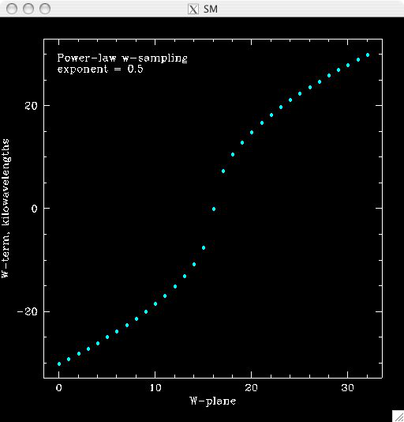
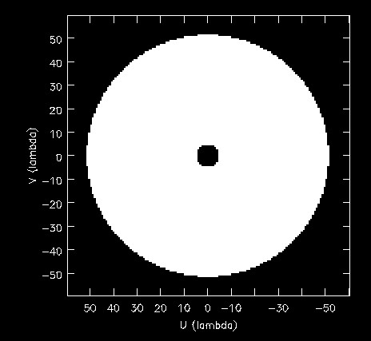
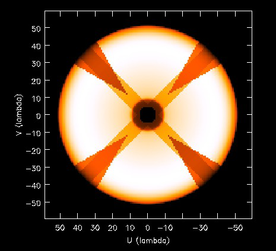
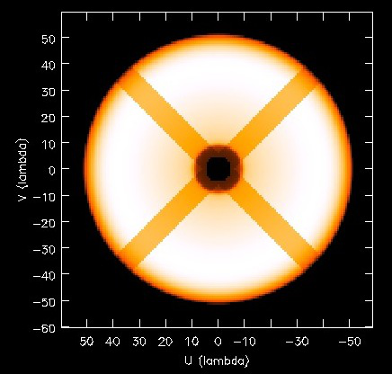
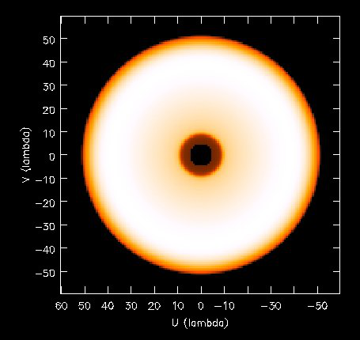

Gridder Documentation
=====================

Overview
--------

The gridders are ASKAPsoft equivalents of Fourier Machines in casa/aips++. They are used for the following 3 operations:

* Putting visibility data onto a regular grid prior to Fourier transform to image space (called gridding or reverse operation).
* Predicting visibility data from a regular grid following the Fourier transform from the image space (called degridding or forward operation)
* Computing PSFs (a special mode of gridding substituting visibility data and convolution functions)

There is a number of gridders available in ASKAPsoft. The same code is used for the actual gridding/degridding for all gridders. The main difference between various gridders is the convolution function used and how the look up is done (i.e. which convolution function among a number of functions stored in the cache is used for a particular visibility point based on the associated metadata). The choice of convolution functions together with the solver used in minor cycle (see :doc:`solver`) largely determine the imaging algorithm. Some gridders (called stacking gridders below) maintain a stack of grids instead of a single grid. An appropriate grid is selected on the basis of associated metadata for each visibility point instead of or in addition to look up of a particular convolution function. These two different variants of gridders are used as two approaches to treat the w-term (non-coplanar baselines). In general, stacking approach is more memory hungry although can be faster than the projection approach.

The gridders can also be divided into two groups: mosaicing and non-mosaicing gridders. The former use convolution functions which include illumination patterns. They are, therefore, primary beam aware and can deal with the datasets containing multiple pointing centres. The output image is always corrected for the primary beam, if a mosaicing gridder is used. The weights image represents the sensitivity pattern. The non-mosaicing gridders effectively assume an infinitely wide primary beam (illumination pattern is a delta function). They will produce incorrect result if dataset contains multiple pointings (either physical pointings of the dish or multiple offset beams). The output image is not corrected for primary beam, if non-mosaicing gridder is used. The weights image is constant across the whole field of view in this case. 

Available gridders
------------------

The following gridders are available in ASKAPsoft:

+----------------+--------------+--------------+----------------------------+------------------------------------+
|*Gridder*       |*Accounts for |*Mosaicing*   |*Convolution function*      |*Notes*                             |
|                |w-term*       |              |                            |                                    |
+================+==============+==============+============================+====================================+
|Box             |No            |No            |Box function                |Very crude nearest neighbour gridder|
+----------------+--------------+--------------+----------------------------+------------------------------------+
|SphFunc         |No            |No            |Spheroidal function         |The simplest useful gridder (just   |
|                |              |              |                            |optimal aliasing rejection)         |
+----------------+--------------+--------------+----------------------------+------------------------------------+
|WProject        |Yes           |No            |Spheroidal function + FT of |Uses W projection to account for the|
|                |(projection)  |              |the w-term                  |w term in the Fourier transform     |
+----------------+--------------+--------------+----------------------------+------------------------------------+
|WStack          |Yes (stacking)|No            |Spheroidal function         |Uses stacking in image space to     |
|                |              |              |                            |account for the w term in the       |
|                |              |              |                            |Fourier transform                   |
+----------------+--------------+--------------+----------------------------+------------------------------------+
|AWProject       |Yes           |Yes           |Spheroidal function + FT of |In addition to WProject, takes into |
|                |(projection)  |              |the w-term + autocorrelation|account primary beam                |
|                |              |              |of antenna illumination     |                                    |
+----------------+--------------+--------------+----------------------------+------------------------------------+
|AProjectWStack  |Yes (stacking)|Yes           |autocorrelation of antenna  |In addition to WStack, takes into   |
|                |              |              |illumination                |account primary beam                |
+----------------+--------------+--------------+----------------------------+------------------------------------+

Parset parameters of the gridders
---------------------------------

Common Parameters
~~~~~~~~~~~~~~~~~

The following are common to all gridders:

+-------------------------------+--------------+--------------+--------------------------------------------------+
|*Parameter*                    |*Type*        |*Default*     |*Description*                                     |
+===============================+==============+==============+==================================================+
|padding                        |float         |1.0           |Factor by which the grid is padded. Internally the|
|                               |              |              |gridder is setup with the grid padding size larger|
|                               |              |              |as if the larger shape would be given. However,   |
|                               |              |              |only the inner part of the image is filled in for |
|                               |              |              |the degridding operation or send back as a result |
|                               |              |              |for gridding. The Fourier transform is done on a  |
|                               |              |              |padded grid. This option is mainly intended for   |
|                               |              |              |faceting (to reduce aliasing from other facets),  |
|                               |              |              |but will work for all gridders and in the         |
|                               |              |              |non-faceted case                                  |
+-------------------------------+--------------+--------------+--------------------------------------------------+
|alldatapsf                     |bool          |false         |Set to true to use all data for PSF calculations  |
|                               |              |              |instead of just the representative feed and       |
|                               |              |              |field. If this flag is false (default), only data |
|                               |              |              |for the first encountered feed and field will be  |
|                               |              |              |used to compute PSF (to avoid a false improving of|
|                               |              |              |the PSF due to a better uv-coverage of a combined |
|                               |              |              |dataset. This feature is introduced largely for   |
|                               |              |              |real ATCA data and is not very relevant for ASKAP |
|                               |              |              |with its parallel mosaicing.                      |
+-------------------------------+--------------+--------------+--------------------------------------------------+
|oversampleweight               |bool          |false         |Set to true to use actual oversampling offset of  |
|                               |              |              |the convolution function in weight computation,   |
|                               |              |              |rather than the zero offset in both coordinates.  |
|                               |              |              |It gives more accurate fluxes, but increases the  |
|                               |              |              |size of weight buffer with the factor of          |
|                               |              |              |oversampling squared (and make weight finalisation|
|                               |              |              |more time consuming)                              |
+-------------------------------+--------------+--------------+--------------------------------------------------+
|MaxPointingSeparation          |string        |"-1rad"       |If specified, this parameter controls the data    |
|                               |              |              |selection at the gridder level based on the       |
|                               |              |              |angular separation between the pointing centre and|
|                               |              |              |the image centre. If this separation exceeds the  |
|                               |              |              |given threshold, the appropriate visibility sample|
|                               |              |              |is rejected. Negative threshold (default) means no|
|                               |              |              |rejection, so all data are used by default. This  |
|                               |              |              |option may be useful if only a small field of view|
|                               |              |              |is imaged out of a larger dataset. The threshold  |
|                               |              |              |is specified as a quantity string, i.e. "1deg".   |
|                               |              |              |It can be used with all gridders, not just        |
|                               |              |              |mosaicing ones.                                   |
+-------------------------------+--------------+--------------+--------------------------------------------------+
|snapshotimaging                |bool          |false         |If true, snapshot imaging is done. In this mode, a|
|                               |              |              |w=au+bv plane is fitted to baseline coordinates   |
|                               |              |              |and the effective w-term becomes a difference     |
|                               |              |              |between the actual w-term and the fitted          |
|                               |              |              |plane. The subtraction of such a plane is         |
|                               |              |              |equivalent to the coordinate                      |
|                               |              |              |distortion. Therefore, every time the fit is      |
|                               |              |              |updated, the current dirty and weight images are  |
|                               |              |              |regridded into a stable frame. How often the new  |
|                               |              |              |fit is done depends on the w-tolerance parameter, |
|                               |              |              |which must be given if the snap-shot imaging is   |
|                               |              |              |used.                                             |
+-------------------------------+--------------+--------------+--------------------------------------------------+
|snapshotimaging.wtolerance     |double        |none          |Required tolerance on residual w-term for         |
|                               |              |              |snap-shot imaging (in wavelengths).This parameter |
|                               |              |              |must be given if the snap-shot imaging is used. An|
|                               |              |              |exception is thrown if the antenna layout is      |
|                               |              |              |significantly non-coplanar and the required       |
|                               |              |              |tolerance cannot be achieved by plane fitting.    |
+-------------------------------+--------------+--------------+--------------------------------------------------+
|snapshotimaging.clipping       |double        |0             |Optional clipping to avoid edge effects during    |
|                               |              |              |image reprojection.This parameter represents the  |
|                               |              |              |fraction of the image size (on each directional   |
|                               |              |              |axis) which is zeroed (equally from both          |
|                               |              |              |sides). It should be a non-negative number less   |
|                               |              |              |than 1. Set it to 0 (default) to avoid any        |
|                               |              |              |clipping.                                         |
+-------------------------------+--------------+--------------+--------------------------------------------------+
|snapshotimaging.reprojectpsf   |bool          |false         |If true, the PSF will be reprojected and          |
|                               |              |              |accumulated the same way as the dirty             |
|                               |              |              |image. Otherwise, a single image (labelled with   |
|                               |              |              |the target coordinates) will be constructed.      |
+-------------------------------+--------------+--------------+--------------------------------------------------+
|snapshotimaging.coorddecimation|uint          |3             |The decimation factor used for coordinate system  |
|                               |              |              |interpolation during regridding. A decimation     |
|                               |              |              |factor of 0 (or 1) implies no decimation, which is|
|                               |              |              |the slowest and most accurate. A larger factor    |
|                               |              |              |will result in faster, but less accurate          |
|                               |              |              |regridding.                                       |
+-------------------------------+--------------+--------------+--------------------------------------------------+
|snapshotimaging.interpmethod   |string        |"cubic"       |Interpolation method for image reprojection, i.e  |
|                               |              |              |cubic, lanczos, linear.                           |
+-------------------------------+--------------+--------------+--------------------------------------------------+
|bwsmearing                     |bool          |false         |If true, the effect of bandwidth smearing is      |
|                               |              |              |predicted.                                        |
+-------------------------------+--------------+--------------+--------------------------------------------------+
|bwsmearing.chanbw              |double        |1e6           |Effective bandwidth of a single spectral channel  |
|                               |              |              |in Hz for the bandwidth smearing simulation.      |
+-------------------------------+--------------+--------------+--------------------------------------------------+
|bwsmearing.nsteps              |int           |10            |Number of integration steps for bandwidth smearing|
|                               |              |              |simulation (i.e. how finer the spectral resolution|
|                               |              |              |is before averaging). A larger number ensures a   |
|                               |              |              |more accurate result at the price of performance. |
+-------------------------------+--------------+--------------+--------------------------------------------------+

 
Note, SphFunc and Box gridders don't have any additional parameters to those listed above. Oversampling factor
which is a configurable parameter for some other gridders is hard coded to be 128 for the SphFunc gridder and 1
for the Box gridder.

Parameters related to w-term (specific to WProject and WStack)
~~~~~~~~~~~~~~~~~~~~~~~~~~~~~~~~~~~~~~~~~~~~~~~~~~~~~~~~~~~~~~

The following parameters are applicable to gridders taking w-term into account. The table below is specific to
WProject and WStack. The same two parameters understood by AProjectWStack and AWProject gridders, but defaults
are different. Therefore, their description is repeated in the discussion of the mosaicing gridders.

+--------------+--------------+--------------+------------------------------------------------------+
|*Parameter*   |*Type*        |*Default*     |*Description*                                         |
+==============+==============+==============+======================================================+
|wmax          |double        |35000.0       |Largest allowed absolute value of the w term in       |
|              |              |              |wavelengths.  An exception will be thrown if the      |
|              |              |              |dataset contains w-term exceeding this value (*W      |
|              |              |              |scaling error: recommend allowing larger range of w*).|
+--------------+--------------+--------------+------------------------------------------------------+
|nwplanes      |int           |65            |Number of w-planes. Number of w planes must be an odd |
|              |              |              |positive number. For the WProject gridder this scales |
|              |              |              |up the number of convolution functions calculated. For|
|              |              |              |the WStack gridder this is the number of grids        |
|              |              |              |maintained. You may (and will) run out of memory for a|
|              |              |              |large number of w planes, especially for the stacking |
|              |              |              |algorithm                                             |
+--------------+--------------+--------------+------------------------------------------------------+
|wstats        |bool          |false         |If true, the gridder will log the statistics at the   |
|              |              |              |end showing the number of times each w-plane has been |
|              |              |              |used since the construction of the gridder            |
+--------------+--------------+--------------+------------------------------------------------------+

Note, no additional parameters are required for the WStack gridder because the convolution function is
just a prolate spheroidal function with well defined support. Oversampling factor which is a configurable
parameter for some other gridders is hard coded to be 128. The WProject gridder uses non-trivial
convolution functions which have w-term applied and requires some additional parameters to find,
e.g. how the support of the convolution function is searched. These parameters are given in the following
section.

Non-linear sampling in w-space (specific to WProject,WStack, AWProject and AProjectWStack)
~~~~~~~~~~~~~~~~~~~~~~~~~~~~~~~~~~~~~~~~~~~~~~~~~~~~~~~~~~~~~~~~~~~~~~~~~~~~~~~~~~~~~~~~~~

These parameters apply to all gridders which take w-term into account. By default w-planes (either stacking
grids or projection planes) are spaced linearly (or equidistantly) in w. The following parameters allow
to enable and control non-linear sampling. Regardless of the parameters, the first and last w-planes
always correspond to -wmax and +wmax, respectively, and the (nwplanes-1)/2 plane corresponds to w=0. 

+--------------------+--------------+--------------+-------------------------------------------------+
|*Parameter*         |*Type*        |*Default*     |*Description*                                    |
+====================+==============+==============+=================================================+
|wsampling           |string        |"linear"      |Type of the sampling in the w-space. The default |
|                    |              |              |is linear, which means that w-planes are set at  |
|                    |              |              |equal distances in w. "powerlaw" means that      |
|                    |              |              |w(plane) is proportional to pow(plane -          |
|                    |              |              |(nwplanes-1)/2,exponent), where the exponent is a|
|                    |              |              |free parameter (must be given). "gaussian" means |
|                    |              |              |the distribution of w(plane) derived from        |
|                    |              |              |truncated gaussian distribution in the range     |
|                    |              |              |-wmax to wmax. This distribution is parameterized|
|                    |              |              |by a single parameter (must be given)            |
|                    |              |              |*nwplanes50*, which means the number of w-planes |
|                    |              |              |(float is allowed) covering inner 50% of the     |
|                    |              |              |-wmax to +wmax range of w-terms. The parameters A|
|                    |              |              |and sigma of the distribution w ~                |
|                    |              |              |A*(1-exp(-plane^2/(2*sigma^2)) are derived       |
|                    |              |              |*nwplanes50* by assuming that the first and the  |
|                    |              |              |last w-planes always correspond to -wmax and     |
|                    |              |              |+wmax respectively and the mid-range plane       |
|                    |              |              |corresponds to w=0. *Note*, *nwplanes50* should  |
|                    |              |              |be a positive number not exceeding approximately |
|                    |              |              |70% of the number of w-planes (it can be shown   |
|                    |              |              |mathematically, that a distribution of this type |
|                    |              |              |with a larger concentration of w-planes does not |
|                    |              |              |exist).                                          |
+--------------------+--------------+--------------+-------------------------------------------------+
|wsampling.exponent  |double        |none          |Exponent of the power law (can't be 0)           |
+--------------------+--------------+--------------+-------------------------------------------------+
|wsampling.nwplanes50|double        |none          |Parameter of the gaussian w-sampling. The number |
|                    |              |              |of w-planes covering inner 50% of the -wmax to   |
|                    |              |              |+wmax value range of w-terms                     |
+--------------------+--------------+--------------+-------------------------------------------------+
|wsampling.export    |string        |""            |If this parameter is not an empty string, the    |
|                    |              |              |actual distribution of w-planes is exported. If  |
|                    |              |              |the value of this parameter is equal to "log",   |
|                    |              |              |the distribution is exported into a usual log    |
|                    |              |              |stream in a human readable form. Otherwise, the  |
|                    |              |              |value of this parameter is interpreted as a file |
|                    |              |              |name, and the distribution is exported into this |
|                    |              |              |file in a machine readable form (three columns of|
|                    |              |              |data being the plane number, the resulting w-term|
|                    |              |              |and the plane number obtained as a result of the |
|                    |              |              |reverse conversion of the w-term into plane      |
|                    |              |              |number)                                          |
+--------------------+--------------+--------------+-------------------------------------------------+
  

An example of the power-law distribution of the w-planes with exponent=0.5 is given below

Additional parameters for gridders with non-trivial convolution functions (WProject. AWProject, AProjectWStack)
~~~~~~~~~~~~~~~~~~~~~~~~~~~~~~~~~~~~~~~~~~~~~~~~~~~~~~~~~~~~~~~~~~~~~~~~~~~~~~~~~~~~~~~~~~~~~~~~~~~~~~~~~~~~~~~

This section gives parameters understood by gridders based on non-trivial (i.e. not box or prolate spheroidal) convolution functions. For
WProject gridder this section describes all remaining parameters in addition to those given above (common for all gridders and shared with
WStack). Mosaicing gridders have further parameters. Note, AProjectWStack does not understand cutoff, variablesupport and offsetsupport parameters as the support size is defined by antenna aperture and is not searched.

+-------------------+--------------+--------------+--------------------------------------------------+
|*Parameter*        |*Type*        |*Default*     |*Description*                                     |
+===================+==============+==============+==================================================+
|cutoff             |double        |1e-3          |Cutoff in determining support (note, relative     |
|                   |              |              |cutoff must be greater than 0.0 and less than     |
|                   |              |              |1.0). The support is searched starting from the   |
|                   |              |              |edge of the image inwards. As soon as the value of|
|                   |              |              |the convolution function exceeds cutoff times the |
|                   |              |              |peak (or just cutoff if absolute cutoff is used,  |
|                   |              |              |see below), the distance from the centre (the     |
|                   |              |              |largest value of two coordinates is used) becomes |
|                   |              |              |the support size. At the moment, we use a single  |
|                   |              |              |value of the support, which is the largest across |
|                   |              |              |all family of convolution functions stored in the |
|                   |              |              |cache. The smaller the cutoff, the larger the     |
|                   |              |              |support size and the more accurate gridding is    |
|                   |              |              |performed.                                        |
+-------------------+--------------+--------------+--------------------------------------------------+
|cutoff.absolute    |bool          |false         |If set to true, the *cutoff* value given by the   |
|                   |              |              |parameter listed above is treated as an absolute  |
|                   |              |              |cutoff value, rather than the fraction of the     |
|                   |              |              |peak. This is an experimental feature.            |
+-------------------+--------------+--------------+--------------------------------------------------+
|oversample         |int           |8             |Oversampling factor. Convolution functions will be|
|                   |              |              |computed for this number of pixels per uv-cell.   |
+-------------------+--------------+--------------+--------------------------------------------------+
|maxsupport         |int           |256           |The largest allowed support size in pixels. The   |
|                   |              |              |grid used to compute the convolution function     |
|                   |              |              |(before the support is searched and the           |
|                   |              |              |appropriate inner part of the grid is extracted)  |
|                   |              |              |is initialised to have the size equal to the      |
|                   |              |              |smallest of maxsupport and the image              |
|                   |              |              |size. WProject uses maxsupport x maxsupport grid  |
|                   |              |              |at the moment regardless of the image size.       |
+-------------------+--------------+--------------+--------------------------------------------------+
|limitsupport       |int           |0             |Upper limit of support. If the determined support |
|                   |              |              |size happens to be greater than this value, the   |
|                   |              |              |support will be capped to this value. This limit  |
|                   |              |              |is applied after the convolution functions are    |
|                   |              |              |calculated, before an inner part of the grid is   |
|                   |              |              |extracted to be stored in the convolution function|
|                   |              |              |cache. The default value of 0 indicates no limit  |
|                   |              |              |is imposed.                                       |
+-------------------+--------------+--------------+--------------------------------------------------+
|variablesupport    |bool          |false         |If true, the support will be searched separately  |
|                   |              |              |for each convolution function. This can speed     |
|                   |              |              |things up considerably, unless costs to search the|
|                   |              |              |support dominates. It was also found that when    |
|                   |              |              |variable support is used, the algorithm is more   |
|                   |              |              |sensitive to cutoff value. Too high cutoff value  |
|                   |              |              |has a significant impact on the image quality if  |
|                   |              |              |the variable support is used.                     |
+-------------------+--------------+--------------+--------------------------------------------------+
|offsetsupport      |bool          |false         |If true, an offset of the convolution function    |
|                   |              |              |will be treated separately (the support will be   |
|                   |              |              |defined by size and offset, which can be non-zero |
|                   |              |              |in general). This option reduces the memory       |
|                   |              |              |footprint and speeds up greeting. It can only be  |
|                   |              |              |used in conjunction with *variablesupport=true*   |
+-------------------+--------------+--------------+--------------------------------------------------+
|tablename          |string        |""            |Name of table to save convolution function        |
|                   |              |              |into. This option largely exists for debugging to |
|                   |              |              |be able to inspect the non-trivial convolution    |
|                   |              |              |function. It should not be normally used. If the  |
|                   |              |              |string is empty (default) the convolution function|
|                   |              |              |is not saved. If the string is prefixed with      |
|                   |              |              |"image:" (i.e. *image:cfuncs.img*), convolution   |
|                   |              |              |functions corresponding to the first oversampling |
|                   |              |              |plane in both axes are stored in the image cube   |
|                   |              |              |instead. Planes of the cube correspond to         |
|                   |              |              |remaining planes (apart from oversampling) of the |
|                   |              |              |convolution function cache. In this mode, only    |
|                   |              |              |reverse (and non-PSF) gridder stores its          |
|                   |              |              |convolution functions.                            |
+-------------------+--------------+--------------+--------------------------------------------------+

Note, that an exception is raised if the support size found during the support search (before being capped by limitsupport) exceeds (number of pixels)/(2*oversample), *Overflowing convolution function - increase maxSupport or decrease overSample*. If the cutoff is too small, one may find it impossible to increase maxsupport (and image size) due to the amount of available memory. Decreasing oversampling factor compromises the quality of imaging. Therefore, in some cases making the cutoff larger is the only option to proceed with calculations on a given machine.

Parameters specific to mosaicing gridders (AWProject and AProjectWStack)
~~~~~~~~~~~~~~~~~~~~~~~~~~~~~~~~~~~~~~~~~~~~~~~~~~~~~~~~~~~~~~~~~~~~~~~~

Mosaicing gridders (AWProject and AProjectWStack) are aware about the primary beam of the instrument and need additional parameters 
to define how it looks like (via illumination pattern), when it needs to be recomputed (tolerances) and how big the cache should be 
(maxfeeds and maxfields). Some parameters given in the two previous sections have different defaults and therefore are repeated here.

+-------------------------+--------------+--------------+--------------------------------------------------+
|*Parameter*              |*Type*        |*Default*     |*Description*                                     |
+=========================+==============+==============+==================================================+
|wmax                     |double        |10000.0       |Largest allowed w term in wavelengths.  See above |
+-------------------------+--------------+--------------+--------------------------------------------------+
|nwplanes                 |int           |65            |Number of w-planes. Number of w planes must be    |
|                         |              |              |odd. See above                                    |
+-------------------------+--------------+--------------+--------------------------------------------------+
|maxsupport               |int           |128           |The largest allowed support size in pixels. See   |
|                         |              |              |above                                             |
+-------------------------+--------------+--------------+--------------------------------------------------+
|frequencydependent       |bool          |true          |If true, illumination pattern will be computed    |
|                         |              |              |separately for each spectral channel              |
+-------------------------+--------------+--------------+--------------------------------------------------+
|maxfeeds                 |int           |1             |Maximum number of feeds allowed                   |
+-------------------------+--------------+--------------+--------------------------------------------------+
|maxfields                |int           |1             |Maximum number of fields allowed                  |
+-------------------------+--------------+--------------+--------------------------------------------------+
|pointingtolerance        |string        |"0.0001rad"   |Pointing tolerance. Fields separated by a larger  |
|                         |              |              |amount considered separate fields and the         |
|                         |              |              |appropriate data are gridded with independent     |
|                         |              |              |convolution functions. An exception is thrown if  |
|                         |              |              |the number of fields exceeds *maxfields*.         |
+-------------------------+--------------+--------------+--------------------------------------------------+
|patolerance              |string        |"0.1rad"      |Parallactic angle tolerance                       |
+-------------------------+--------------+--------------+--------------------------------------------------+
|freqtolerance            |string        |undefined     |Frequency tolerance (relative, threshold for      |
|                         |              |              |df/f), negative value or word *infinite* mean the |
|                         |              |              |frequency axis is ignored                         |
+-------------------------+--------------+--------------+--------------------------------------------------+
|illumination             |string        |"disk"        |Illumination model used with this gridder. Default|
|                         |              |              |is disk. Dish and blockage sizes are defined      |
|                         |              |              |regardless of the model used (because all         |
|                         |              |              |illumination models require them). Different      |
|                         |              |              |models require different parameters. Either disk  |
|                         |              |              |or ATCA.                                          |
+-------------------------+--------------+--------------+--------------------------------------------------+
|illumination.*Property*  |              |              |Additional parameters of illumination model (see  |
|                         |              |              |below). Exact list of available properties depends|
|                         |              |              |on the illumination model used. Diameter and      |
|                         |              |              |blockage (below) are given as gridder             |
|                         |              |              |parameters. None of the extra properties are      |
|                         |              |              |required for disk illumination.                   |
+-------------------------+--------------+--------------+--------------------------------------------------+
|diameter                 |double        |none          |Dish diameter in metres                           |
+-------------------------+--------------+--------------+--------------------------------------------------+
|blockage                 |double        |none          |Size of the central whole in metres               |
+-------------------------+--------------+--------------+--------------------------------------------------+

An example of the disk illumination for diameter 22m and blockage of 2m. For all illumination examples given below the frequency is assumed to be 1.4 GHz

ATCA Illumination
~~~~~~~~~~~~~~~~~

This illumination pattern allows to simulate additional effects (e.g. feed leg shadows, tapering) on top of the disk illumination. With the
tapering, feedlegs and wedges parameters set to false, this illumination pattern is equivalent to disk (blockage and diameter are given as
parameters of the gridder, rather than as parameters of illumination pattern because they apply to both currently implemented types of 
illumination). ATCA illumination has the following parameters:

+------------------------------------------+--------------+------------+-----------------------------------------------+
|*Parameter*                               |*Type*        |*Default*   |*Description*                                  |
+==========================================+==============+============+===============================================+
|illumination.tapering                     |bool          |true        |This option switches on Jamesian tapering      |
|                                          |              |            |(i.e. imperfect illumination). The parameters  |
|                                          |              |            |of the taper are hard coded at the moment and  |
|                                          |              |            |correspond to the ATCA model.                  |
+------------------------------------------+--------------+------------+-----------------------------------------------+
|illumination.tapering.defocusing          |string        |0rad        |Only valid if illumination.tapering = true. An |
|                                          |              |            |additional phase term is applied to the        |
|                                          |              |            |Jamesian illumination.The phase varies         |
|                                          |              |            |quadratically with radius from 0 at the dish   |
|                                          |              |            |centre to the value given in this parameter at |
|                                          |              |            |the edge.                                      |
+------------------------------------------+--------------+------------+-----------------------------------------------+
|illumination.feedlegs                     |bool          |true        |If true, feed leg shadows are simulated        |
|                                          |              |            |(i.e. partial blockage of the radiation by the |
|                                          |              |            |struts supporting the subreflector/focus cabin)|
+------------------------------------------+--------------+------------+-----------------------------------------------+
|illumination.feedlegs.width               |string        |1.8m        |Only applicable if illumination.feedlegs =     |
|                                          |              |            |true. The width of the shadows in the absolute |
|                                          |              |            |units (as dish diameter is also given in the   |
|                                          |              |            |absolute units)                                |
+------------------------------------------+--------------+------------+-----------------------------------------------+
|illumination.feedlegs.rotation            |string        |45deg       |Only applicable if illumination.feedlegs =     |
|                                          |              |            |true. The angle the shadows are rotated. It    |
|                                          |              |            |corresponds to installation angle of the actual|
|                                          |              |            |feeds. If this parameter is zero, the shadows  |
|                                          |              |            |go in the u and v direction. At ATCA the feeds |
|                                          |              |            |are installed at 45 deg angle, which is the    |
|                                          |              |            |default.                                       |
+------------------------------------------+--------------+------------+-----------------------------------------------+
|illumination.feedlegs.shadowing           |double        |0.75        |Only applicable if illumination.feedlegs =     |
|                                          |              |            |true. This parameter describes how transparent |
|                                          |              |            |feed leg shadows are. Zero indicates a total   |
|                                          |              |            |blockage, one a total transparency.            |
+------------------------------------------+--------------+------------+-----------------------------------------------+
|illumination.feedlegs.wedges              |bool          |true        |Only applicable if illumination.feedlegs =     |
|                                          |              |            |true. If this parameter is set to true, shadow |
|                                          |              |            |wedges resulted from multiple reflections      |
|                                          |              |            |(e.g. in the Cassegrain design). The wedges are|
|                                          |              |            |simulated as triangular shadows on top of the  |
|                                          |              |            |feed leg shadows (adding more opacity)         |
+------------------------------------------+--------------+------------+-----------------------------------------------+
|illumination.feedlegs.wedges.shadowing    |vector<double>|[0.6,0.5]   |Only valid if illumination.feedlegs.wedges =   |
|                                          |              |            |true. Transparency factors for wedges          |
|                                          |              |            |corresponding to the horizontal and vertical   |
|                                          |              |            |(without rotation) feed legs. Zero indicates a |
|                                          |              |            |total blockage, one is for total               |
|                                          |              |            |transparency.This opacities are applied        |
|                                          |              |            |linearly on top of the normal feed leg         |
|                                          |              |            |shadowing factor. Either one or two values     |
|                                          |              |            |could be given. If one value is given it       |
|                                          |              |            |corresponds to all wedges.                     |
+------------------------------------------+--------------+------------+-----------------------------------------------+
|illumination.feedlegs.wedges.angle        |string        |15deg       |Only valid if illumination.feedlegs.wedges =   |
|                                          |              |            |true. Opening angle for all triangular wedges. |
+------------------------------------------+--------------+------------+-----------------------------------------------+
|illumination.feedlegs.wedges.startradius  |string        |3.5m        |Only valid if illumination.feedlegs.wedges =   |
|                                          |              |            |true. The radius of the vertex for all         |
|                                          |              |            |triangular wedges.                             |
+------------------------------------------+--------------+------------+-----------------------------------------------+

Example of the ATCA illumination model created with default parameters (i.e. with feed legs and wedges enabled)

Example of the ATCA illumination model without wedges and with default values of other parameters.

Example of the ATCA illumination model without feedlegs (and wedges). All other parameters have default values. This case is essentially a disk with tapering.

Examples
~~~~~~~~

Simple example:

.. code-block:: bash

    Cimager.gridder                                 = WProject
    Cimager.gridder.WProject.wmax                   = 15000
    Cimager.gridder.WProject.nwplanes               = 129
    Cimager.gridder.WProject.oversample             = 8
    Cimager.gridder.WProject.maxsupport             = 1024
    Cimager.gridder.WProject.tablename              = WProject.tab

Example with ATCA illumination pattern:

.. code-block:: bash

    Cimager.gridder                                   = AProjectWStack
    Cimager.gridder.alldatapsf                        = true
    Cimager.gridder.padding                           = 1
    Cimager.gridder.AProjectWStack.wmax               = 1.0
    Cimager.gridder.AProjectWStack.diameter           = 22m
    Cimager.gridder.AProjectWStack.blockage           = 3.6m
    Cimager.gridder.AProjectWStack.nwplanes           = 1
    Cimager.gridder.AProjectWStack.oversample         = 16
    Cimager.gridder.AProjectWStack.cutoff             = 0.001
    Cimager.gridder.AProjectWStack.maxfeeds           = 1
    Cimager.gridder.AProjectWStack.maxfields          = 1
    Cimager.gridder.AProjectWStack.maxsupport         = 1024
    Cimager.gridder.AProjectWStack.frequencydependent = true

    Cimager.gridder.AProjectWStack.illumination                             = ATCA
    Cimager.gridder.AProjectWStack.illumination.tapering                    = true
    Cimager.gridder.AProjectWStack.illumination.tapering.defocusing         = 0deg
    Cimager.gridder.AProjectWStack.illumination.feedlegs                    = true
    Cimager.gridder.AProjectWStack.illumination.feedlegs.width              = 1.0m
    Cimager.gridder.AProjectWStack.illumination.feedlegs.rotation           = 45deg
    Cimager.gridder.AProjectWStack.illumination.feedlegs.shadowing          = 0.75
    Cimager.gridder.AProjectWStack.illumination.feedlegs.wedges             = true
    Cimager.gridder.AProjectWStack.illumination.feedlegs.wedges.shadowing   = [0.6,0.5]
    Cimager.gridder.AProjectWStack.illumination.feedlegs.wedges.angle       = 15deg
    Cimager.gridder.AProjectWStack.illumination.feedlegs.wedges.startradius = 3.5m
