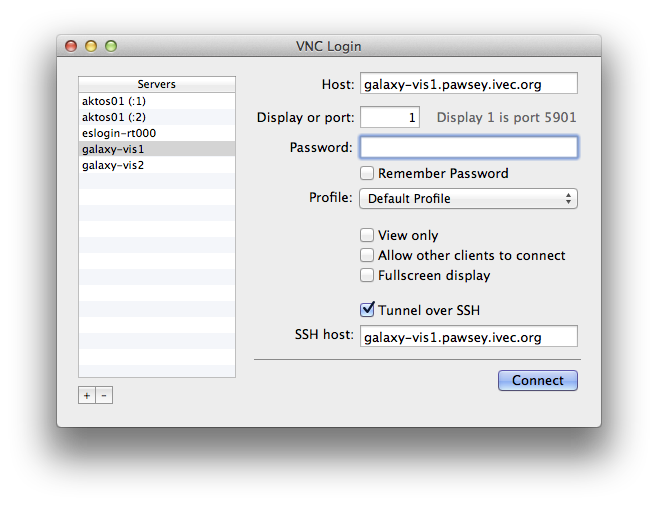

Using CASA
==========

While the ASKAP Central Processor was not specifically designed to run CASA, there are a
number of approaches to using CASA. It can be run on the compute nodes, however there is
no X-Windows system there, so GUI tools such as casaviewer, casabrowser & casaplotms will
not work. We do have a number of (temporarily) "spare" nodes which we can temporarily
dedicate to CASA usage. These are Dell servers with 64GB RAM. However these nodes are part
of the ingest pipeline infrastructure and will be dedicated to that purpose as more
antennas come online.

The two nodes that have been earmarked for temporary CASA usage are *galaxy-vis1* and
*galaxy-vis2*. Two approaches to running CASA are described below: 1) using VNC and 2) using
X11-Forwarding.

.. warning:: Neither casapy nor any of the CASA GUI tools (casaviewer, casabrowser, casaplotms)
             should be executed on the login nodes (eslogin-rt000 or eslogin-rt001). Using
             these tools often results in memory exhaustion and will hang the login nodes,
             preventing all users from accessing the system.

Running CASA via VNC
--------------------

A remote desktop environment can be accessed via VNC. Either of the two visulisation servers
can be used to host a VNC server. First you must login to one of the visulisation servers
and start the VNC server::

    ssh galaxy-vis1.pawsey.ivec.org
    vncserver -geometry 1024x768 -depth 24

Note, you may choose any geometry you want, 1024x768 is just an example. You may wish to
run the VNC session in full-screen mode, in which case the geometry should match your
monitor. You will then be prompted to enter a password. Be sure to choose a secure
password, as anyone within the iVEC network can potentially connect to your VNC server.
You will also be prompted to enter a *view only* password, you can answer no to this. You
will then see output similar to the following::

    New 'X' desktop is esDM015:1

    Starting applications specified in /home/hum092/.vnc/xstartup
    Log file is /home/hum092/.vnc/esDM015:1.log

Shortly you will be configuring your VNC client and you will need the number after the full-colon
in the first line, in this case "1". Now the VNC server is started and is waiting for your VNC
client to connect. You are free to use the VNC client of your choice, however as you will be
connecting via an SSH tunnel (the VNC port is blocked at the iVEC firewall) you will want a client
with SSH tunnelling support. On Mac OSX the VNC client "Chicken" works well.

Below is a screen shot of the VNC configuration. The settings you will need to enter are:
  * **Host:** - This is either *galaxy-vis1.pawsey.ivec.org* or *galaxy-vis2* depending on which
    host you logged in to
  * **Display or port** - This is the number returned when executing the VNC server
  * **Password** - This is the password you entered when you started the VNC server
  * **Tunnel over SSH** - Tick this
  * **SSH Host** - This is the same as the *Host* field above

Once you connect with your VNC client you can start a terminal and launch CASA like with
the following commands::

    module load casa
    casa

While you may wish to leave your session running for long periods of time, you should be
sure to *kill* it when you are no longer using it. Each VNC sessions requires memory, and
with many users it is possible to exhaust available memory. The VNC server can be killed
with the following command::

    vncserver -kill :1

Note the "1" should be replaced with the display number you recieved when executing the
*vncserver* command.

Using the GNOME desktop manager
~~~~~~~~~~~~~~~~~~~~~~~~~~~~~~~

The default desktop manager, TWM, may be unfamiliar. You can use GNOME instead, which
provides a more familiar windowing environment. To use GNOME:

1. Kill the VNC server you have started (ignore this step if you have not got a server
   currently running)

2. Edit the VNC xstartup file (~/.vnc/xstartup) to only contain the following::

    #!/bin/sh
    /usr/bin/gnome-session

3. Start the VNC server using the instructions described above.

Running interactive CASA with X11-Forwarding
--------------------------------------------

The GUI tools can be used and will be displayed on your desktop via X11-Forwarding. This approach
is better suited to local machines, and you will notice it is not particularly fast.

The following commands will launch CASA::

    ssh -Y galaxy-vis1.pawsey.ivec.org
    module load casa
    casa

Note you can choose from *galaxy-vis1* or *galaxy-vis2*. These nodes share the home directory
with the Cray supercomputer itself and also mount the /scratch filesystem.

Running CASA on Compute Nodes
-----------------------------

.. note:: CASA has not been well tested on the Cray platform, and indeed CASA is not designed 
          to be run in a HPC environment.

An interactive CASA session can be run on a compute node by submitting an *interactive*
job. To lauch an interactive CASA session on a compute node first save this script to a
file named *interactive.qsub*::

    #!/bin/bash -l
    #PBS -l walltime=24:00:00
    #PBS -l mppwidth=1
    #PBS -l mppnppn=1
    #PBS -N interactive
    #PBS -I

Then execute is like you would a normal batch job::

    qsub interactive.qsub

However instead of simply queuing the job then returning, the command will print out a message
indicating it is waiting for the job to start::

    qsub: waiting for job 1234.rtc to start

then it will block until a compute node is available. When a compute node is available (and one
may well be immediately available) you will be presented with a shell prompt::

    qsub: job 1234.rtc ready

    joe123@nid00002:~>

From here you can load the module for CASA and execute CASAPY::

    module load casa
    aprun -b casa --nologger --log2term --nogui
