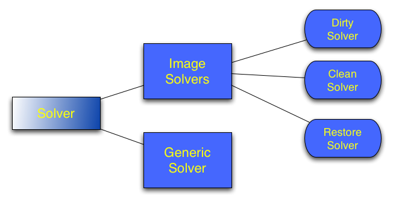

Solver Documentation
====================

A number of solvers are available in ASKAPsoft. For imaging purposes only specialized image solvers are generally used, although generic 
SVD-based linear solver (see the diagram above) can be used with (very small) images as well (some change to the code may be required
as this is not a normal use case). The *solver* parset parameter defines the type of the image solver to use with the choice between
*Dirty*, *and Clean*. The *Dirty* solver just inverts the data (takes the normal equations and simply divides the data vector by the
diagonal of the normal matrix. This is analogous to making the dirty image or a linear mosaic of dirty images), while the Clean performs
minor cycle cleaning. If multiple beams and/or fields are present in the dataset (and mosaicing gridders 
(see :doc:`gridder` for details) are used), joint deconvolution is always preformed (individual deconvolution is not supported).

The Restore solver is somewhat special. It is executed behind the scene with very minimal setup required from the user (the same parameters
are generally used as for the cleaning solver). Restore solver is described separately in the :doc:`cimager`.

Common Parameters
-----------------

Parameters for all solvers:

+-------------------+--------------+--------------+--------------------------------------------------------+
|**Parameter**      |**Type**      |**Default**   |**Description**                                         |
+===================+==============+==============+========================================================+
|solver             |string        |none          |Selection of solver. Specify either "Clean" or "Dirty"  |
+-------------------+--------------+--------------+--------------------------------------------------------+
|verbose            |string        |"true"        |True enables lots of output                             |
+-------------------+--------------+--------------+--------------------------------------------------------+
|tolerance          |float         |0.1           |cutoff value given as a fraction of the largest diagonal|
|                   |              |              |element. The linear system describing interferometric   |
|                   |              |              |measurement is inverted approximately, assuming that the|
|                   |              |              |matrix is diagonal, i.e. the right-hand side is divided |
|                   |              |              |by the appropriate diagonal element (which is a         |
|                   |              |              |weight). If diagonal is smaller than this tolerance     |
|                   |              |              |multiplied by the largest diagonal element, the         |
|                   |              |              |right-hand side instead is either divided by the largest|
|                   |              |              |diagonal element to get the result or the result is set |
|                   |              |              |to zero. This is controlled by **weightcutoff**         |
|                   |              |              |parameter. For images it means that areas with low      |
|                   |              |              |weight (i.e. a mosaic edge) are not boosted up. In      |
|                   |              |              |addition to weight truncation, all pixels with the      |
|                   |              |              |weight below cutoff are normally masked out. The        |
|                   |              |              |**weightcutoff.clean** parameter allows to assign mask  |
|                   |              |              |corresponding to weight truncation. This allows         |
|                   |              |              |S/N-based cleaning to happen, if the peak of S/N is     |
|                   |              |              |realised outside the nominal field of view.             |
+-------------------+--------------+--------------+--------------------------------------------------------+
|weightcutoff       |string        |truncate      |Either "zero" or "truncate". This parameter controls    |
|                   |              |              |what actually happens for values below cutoff defined by|
|                   |              |              |the **tolerance** parameter. If **zero** is given, the  |
|                   |              |              |appropriate values are set to zero. For **truncate**,   |
|                   |              |              |the values are divided by the largest diagonal.         |
+-------------------+--------------+--------------+--------------------------------------------------------+
|weightcutoff.clean |bool          |false         |This parameter defines whether the values below cutoff  |
|                   |              |              |are masked out or not. By default, the are masked out   |
|                   |              |              |and so S/N-based clean never finds optima among these   |
|                   |              |              |values. If this parameter is true, the mask is actually |
|                   |              |              |sqrt(tolerance), which corresponds to truncation of the |
|                   |              |              |diagonal during normalisation. This potentially allows  |
|                   |              |              |cleaning to happen, if no peak of the S/N is realised   |
|                   |              |              |among these values.                                     |
+-------------------+--------------+--------------+--------------------------------------------------------+

Parameters **verbose** and **tolerance** have **solver.Clean** or **solver.Dirty** prefix. Although verbose is
understood by dirty solver, there is currently no effect. **Dirty** solver doesn't require any additional
parameters (but one can also set up a preconditioner described in the following section with the dirty solver).
Additional parameters understood by the **Clean** solver are given in the following section. 

Clean Solver Parameters
-----------------------

All parameters given in the next table have **solver.Clean** prefix (i.e. Cimager.solver.Clean.algorithm) or
Cimager.solver.Clean.scales. The *Clean* solver with algorithm set to "Basisfunction" is an improved version
of the casacore *LatticeCleaner*. Most importantly, it supports use of a patch in the deconvolution. This
decreases memory use and run time by approximately the ratio of pixels in the patch to pixels in the image.

+-------------------+--------------+--------------+--------------------------------------------------------+
|**Parameter**      |**Type**      |**Default**   |**Description**                                         |
+===================+==============+==============+========================================================+
|algorithm          |string        |"MultiScale"  |Valid choices are "MultiScale", "Basisfunction",        |
|                   |              |              |"Hogbom", "MultScaleMFS" and "BasisfunctionMFS". Use    |
|                   |              |              |"Hogbom" for a single scale, non-MFS case. For the Clean|
|                   |              |              |solver, the casacore's *LatticeCleaner* used to do the  |
|                   |              |              |actual work in non-MSMFS case will be set up with       |
|                   |              |              |*CleanEnums::HOGBOM* if algorithm is Hogbom and the     |
|                   |              |              |single scale of 0 will be used.  For the Basisfunction  |
|                   |              |              |algorithm, a re-implemented and improved version of the |
|                   |              |              |CASA MultiScale algorithm is used                       |
+-------------------+--------------+--------------+--------------------------------------------------------+
|scales             |vector<string>|[0, 3, 10]    |Scales to be solved (defined in pixels). Ignored if     |
|                   |              |              |algorithm="Hogbom"                                      |
+-------------------+--------------+--------------+--------------------------------------------------------+
|niter              |int           |100           |Number of minor cycles                                  |
+-------------------+--------------+--------------+--------------------------------------------------------+
|gain               |float         |0.7           |Loop gain. Fraction of the peak subtracted during one   |
|                   |              |              |minor cycle.                                            |
+-------------------+--------------+--------------+--------------------------------------------------------+
|speedup            |float         |no speed up   |Relevant for "MultiScale" and "MultiScaleMFS" only. If  |
|                   |              |              |defined, the value will be passed as a speed up factor  |
|                   |              |              |to the lattice cleaners doing the minor cycle. According|
|                   |              |              |to casacore's manual, this will speed up clean by       |
|                   |              |              |raising the threshold (could help if the threshold set  |
|                   |              |              |too low for the given dataset). The physical meaning of |
|                   |              |              |the parameter is the number of iterations required to   |
|                   |              |              |double the threshold.                                   |
+-------------------+--------------+--------------+--------------------------------------------------------+
|padding            |float         |1.0           |Optional padding of all images in the solver (minor     |
|                   |              |              |cycle will be done on an image this factor times larger |
|                   |              |              |on both axes, e.g. to alleviate the fact that FFT is    |
|                   |              |              |used to compute convolutions). Default value means no   |
|                   |              |              |padding. At this stage this option is understood by     |
|                   |              |              |**MultiScale** cleaner only                             |
+-------------------+--------------+--------------+--------------------------------------------------------+
|saveintermediate   |bool          |true          |Save intermediate images (residuals and preconditioned  |
|                   |              |              |PSF) at the end of each majorcycle.                     |
+-------------------+--------------+--------------+--------------------------------------------------------+

The following parameters are available for the Basisfunction and BasisfunctionMFS algorithms.

+-------------------+--------------+--------------+--------------------------------------------------------+
|**Parameter**      |**Type**      |**Default**   |**Description**                                         |
+===================+==============+==============+========================================================+
|psfwidth           |int           |0             |Sets the width of the psf patch used in the minor       |
|                   |              |              |cycle. This decreases memory use and run time by        |
|                   |              |              |approximately the ratio of pixels in the patch to pixels|
|                   |              |              |in the image.                                           |
+-------------------+--------------+--------------+--------------------------------------------------------+

All parameters given in the next table **do not** have **solver.Clean** prefix (i.e. Cimager.threshold.minorcycle)

+------------------------+---------------+--------------+--------------------------------------------------+
|**Parameter**           |**Type**       |**Default**   |**Description**                                   |
+========================+===============+==============+==================================================+
|threshold.minorcycle    |vector<string> |no threshold  |If defined, the parameter can be either a single  |
|                        |               |              |string or a vector of two strings. A number       |
|                        |               |              |without units is interpreted as a fractional      |
|                        |               |              |stopping threshold (with respect to the peak      |
|                        |               |              |residual) as well as the number with the          |
|                        |               |              |percentage sign. An absolute flux given in Jy or  |
|                        |               |              |related units is interpreted as an absolute       |
|                        |               |              |threshold. Either one or both of these thresholds |
|                        |               |              |can be given in the same time. Undefined parameter|
|                        |               |              |means no minor cycle thresholding is done         |
+------------------------+---------------+--------------+--------------------------------------------------+
|threshold.majorcycle    |string         |-1Jy          |The target peak residual. Use negative value to   |
|                        |               |              |ensure all requested major cycles are done.       |
+------------------------+---------------+--------------+--------------------------------------------------+
|threshold.masking       |float          |-1            |If the value is negative (default), a             |
|                        |               |              |signal-to-noise based cleaning is done. In other  |
|                        |               |              |words, a peak of S/N is searched at every minor   |
|                        |               |              |cycle, rather than a flux peak. A positive value  |
|                        |               |              |reverts the algorithm back to the traditional     |
|                        |               |              |absolute flux peak-based clean. In this case, the |
|                        |               |              |value is the threshold used for masking on the    |
|                        |               |              |basis of the weight. For example, a value of 0.9  |
|                        |               |              |(btw, this is the default in the casacore's       |
|                        |               |              |*LatticeCleaner*, and, therefore, could be        |
|                        |               |              |implicitly adopted in casa imager) means that all |
|                        |               |              |pixels with less than 90% weight (defined as      |
|                        |               |              |square root from the ratio of matrix diagonal to  |
|                        |               |              |the maximum diagonal element) will be masked out  |
|                        |               |              |for cleaning purposes.                            |
+------------------------+---------------+--------------+--------------------------------------------------+
|preconditioner.Names    |vector<string> |empty vector  |List of preconditioners to be applied (in the     |
|                        |               |              |order they are given in the list). Preconditioners|
|                        |               |              |are ASKAPsoft equivalents of weighting            |
|                        |               |              |(i.e. uniform, robust, natural), which do not     |
|                        |               |              |require multiple passes over the                  |
|                        |               |              |dataset. Preconditioners can be viewed as         |
|                        |               |              |operators applied to equation matrix before it is |
|                        |               |              |solved. Having the normal matrix as close to the  |
|                        |               |              |diagonal as possible (a diagonal form is actually |
|                        |               |              |assumed during the inversion process) makes the   |
|                        |               |              |inversion more accurate. By default, no           |
|                        |               |              |transformation to the normal matrix is done. This |
|                        |               |              |is equivalent to the natural weighting. The       |
|                        |               |              |following preconditioners are currently           |
|                        |               |              |implemented: **Wiener**, **NormWiener**,          |
|                        |               |              |**Robust** and **GaussianTaper**. In addition, the|
|                        |               |              |word **None** is understood as an empty           |
|                        |               |              |preconditioner which does nothing. Each           |
|                        |               |              |preconditioner requires a specific set of         |
|                        |               |              |parameters described in a separate section. These |
|                        |               |              |parameters are given after the name of the        |
|                        |               |              |preconditioner,                                   |
|                        |               |              |e.g. **preconditioner.Wiener.noisepower** (see    |
|                        |               |              |below)                                            |
+------------------------+---------------+--------------+--------------------------------------------------+
|preconditioner.name.xxx |               |              |Use this form to define parameter **xxx** for     |
|                        |               |              |preconditioner **name**. Note, this preconditioner|
|                        |               |              |will only be instantiated and used if its name    |
|                        |               |              |appears in the list given in                      |
|                        |               |              |preconditioner.Names. Description of individual   |
|                        |               |              |parameters are given in a separate section.       |
+------------------------+---------------+--------------+--------------------------------------------------+
   

Parameters of preconditoners
----------------------------

Normal matrix can optionally be transformed by the preconditioning operator before equations are solved.
This step can regularise the matrix and improve the quality of the solution. It is the ASKAPsoft way to
implement weighting in imaging (e.g. uniform, robust) which does not require an additional pass over the
data. The following preconditioners are currently implemented: **Wiener**, **NormWiener**, **Robust** and **GaussianTaper**.

They are described below along with the available parameters. The parameters need a **preconditioner.preconditionerName**
prefix, but without the **solver** prefix (i.e. **Cimager.preconditioner.Wiener.noisepower**), although
technically preconditioning step is done in solver. When defined this way, the same parameters can be reused
in the *restore solver*. The table below contains the description of individual parameters (names starts with
**preconditionerName**) 

+-----------------------+--------------+--------------+----------------------------------------------------+
|**Parameter**          |**Type**      |**Default**   |**Description**                                     |
+=======================+==============+==============+====================================================+
|Wiener.noisepower      |float         |none          |Wiener filter constructed from the PSF is           |
|                       |              |              |applied. This preconditioner is somewhat analogous  |
|                       |              |              |to robust weighting. If defined with noisepower     |
|                       |              |              |(btw, it is incompatible with definition via        |
|                       |              |              |robustness), this exact value of noise power will be|
|                       |              |              |used to construct the filter. Optionally, the PSF   |
|                       |              |              |can be normalised before the filter is constructed  |
|                       |              |              |(see **normalise** option - this is a replacement   |
|                       |              |              |for **NormWiener** preconditioner).                 |
+-----------------------+--------------+--------------+----------------------------------------------------+
|Wiener.normalise       |bool          |false         |This is an additional option for **Wiener**         |
|                       |              |              |preconditioner constructed from explicit value of   |
|                       |              |              |the noise power. If set to true, the PSF will be    |
|                       |              |              |normalised to 1.0 before the filter is constructed. |
|                       |              |              |Therefore, interpretation of the noise power        |
|                       |              |              |parameter is easier. Note, this option is           |
|                       |              |              |incompatible with **robustness** because in this    |
|                       |              |              |case PSF is always normalised).                     |
+-----------------------+--------------+--------------+----------------------------------------------------+
|Wiener.robustness      |float         |none          |Wiener filter constructed from the PSF is           |
|                       |              |              |applied. The noise power is derived from the given  |
|                       |              |              |value of robustness to have roughly the same effect |
|                       |              |              |as analogous parameter in Robust. This option is    |
|                       |              |              |incompatible with any other parameter of the        |
|                       |              |              |preconditioner                                      |
+-----------------------+--------------+--------------+----------------------------------------------------+
|Wiener.taper           |float         |none          |If defined, Wiener filter will be tapered in the    |
|                       |              |              |image domain with the Gaussian. The value of the    |
|                       |              |              |parameter is FWHM of the taper in image pixels.     |
+-----------------------+--------------+--------------+----------------------------------------------------+
|NormWiener.robustness  |float         |0.0           |Roughly same effect as the same parameter in Robust |
+-----------------------+--------------+--------------+----------------------------------------------------+
|Robust.robustness      |float         |0.0           |Post-gridding version of robust weighting is        |
|                       |              |              |applied.                                            |
+-----------------------+--------------+--------------+----------------------------------------------------+
|GaussianTaper          |vector<string>|None          |Gaussian taper is applied. The parameter should be  |
|                       |              |              |either a single string with the angular size for a  |
|                       |              |              |circular gaussian or a vector of 3 strings with     |
|                       |              |              |major and minor axes and position angle for an      |
|                       |              |              |elliptical taper. String values may contain units,  |
|                       |              |              |i.e. **[10arcsec,10arcsec,34deg]**. If no units are |
|                       |              |              |given, radians are assumed. Gaussian taper currently|
|                       |              |              |conflicts with different uv-cell sizes for different|
|                       |              |              |images. An exception is thrown if such a condition  |
|                       |              |              |exists.                                             |
+-----------------------+--------------+--------------+----------------------------------------------------+

Examples
--------

Multi-scale Clean Solver
~~~~~~~~~~~~~~~~~~~~~~~~

.. code-block:: bash

    Cimager.solver                                  = Clean
    Cimager.solver.Clean.algorithm                  = MultiScale
    Cimager.solver.Clean.scales                     = [0, 3, 10]
    Cimager.solver.Clean.niter                      = 10000
    Cimager.solver.Clean.gain                       = 0.1
    Cimager.solver.Clean.tolerance                  = 0.1
    Cimager.solver.Clean.verbose                    = True
    Cimager.threshold.minorcycle                    = [0.27mJy, 10%]
    Cimager.threshold.majorcycle                    = 0.3mJy
    Cimager.preconditioner.Names                    = [Wiener,GaussianTaper]
    Cimager.preconditioner.GaussianTaper            = [30arcsec, 8arcsec, 10deg]
    Cimager.preconditioner.Wiener.noisepower        = 100.0
    Cimager.ncycles                                 = 5
    Cimager.restore                                 = True
    Cimager.restore.beam                            = [30arcsec, 30arcsec, 0deg]

Dirty Solver
~~~~~~~~~~~~

.. code-block:: bash

    Cimager.solver                                  = Dirty
    Cimager.solver.Dirty.tolerance                  = 0.1
    Cimager.solver.Dirty.verbose                    = True
    Cimager.ncycles                                 = 0
