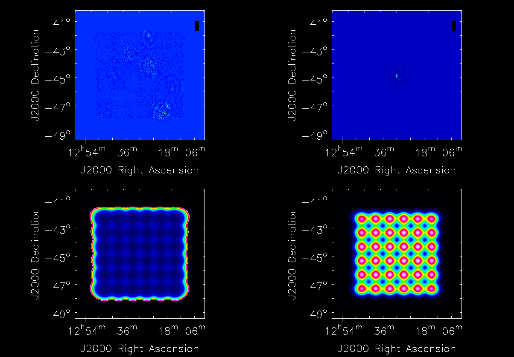

Basic Tutorial
==============

This tutorial demonstrates basic operation of the ASKAP Central Processor platform,
and does so by walking you through the process of imaging a simulated BETA dataset.

The simulated measurement set has the following specifications:

* Sky model: SKADS S3SEX Simulated Sky
* Array Configuration: BETA (Pad01,Pad03,Pad06,Pad08,Pad09,Pad15)
* Observation Length: 12 hours
* Correlator integration time: 30s
* Number of beams: 36
* Polarisations: XX & YY
* Number of spectral channels: 304
* Channel width: 1MHz
* Tsys: 50K
* Gains corruption: None

Prerequisites
-------------
You should read the :doc:`../platform/processing` documentation and in particular have
setup your environment per the section entitled "Setting up your account".

Setting up a working directory
------------------------------
Your working directory will not be within your home directory, instead it will reside
on the fast Lustre filesystem::

    cd /scratch/$USER
    mkdir basictutorial
    cd basictutorial

Retrieving the tutorial dataset
-------------------------------
The measurement set used in this tutorial resides on the "Commissioning Archive" and
can be retrieved using the scp command. As the measurement set may need to be fetched
from tape, it should be staged first::

    ssh cortex.ivec.org /opt/SUNWsamfs/bin/stage -r /pbstore/groupfs/askap/tutorials/basic1/coarse_chan.ms
    scp -r cortex.ivec.org:/pbstore/groupfs/askap/tutorials/basic1/coarse_chan.ms .

You may notice the **scp** may stall. This is likely due to the fact the data has not been
fetched (staged) from tape to disk. This is quite normal, and the length of the stall depends
upon the load on the system (e.g. other users).

Creating a dirty image
----------------------
Since the measurement set has no calibration errors we can move straight to imaging. First we
will produce a dirty image with the **cimager** program. Create the following configuration file
for cimager, lets call it *dirty.in*::

    Cimager.dataset                                 = coarse_chan.ms

    # Each worker will read a single channel selection
    Cimager.Channels                                = [1, %w]
    #
    Cimager.Images.Names                            = [image.i.dirty]
    Cimager.Images.shape                            = [3328,3328]
    Cimager.Images.cellsize                         = [10arcsec,10arcsec]
    Cimager.Images.image.i.dirty.frequency          = [1.270e9,1.270e9]
    Cimager.Images.image.i.dirty.nchan              = 1
    Cimager.Images.image.i.dirty.direction          = [12h30m00.00, -45.00.00.00, J2000]
    #
    Cimager.gridder.snapshotimaging                 = true
    Cimager.gridder.snapshotimaging.wtolerance      = 1000
    Cimager.gridder                                 = AWProject
    Cimager.gridder.AWProject.wmax                  = 1000
    Cimager.gridder.AWProject.nwplanes              = 33
    Cimager.gridder.AWProject.oversample            = 4
    Cimager.gridder.AWProject.diameter              = 12m
    Cimager.gridder.AWProject.blockage              = 2m
    Cimager.gridder.AWProject.maxfeeds              = 36
    Cimager.gridder.AWProject.maxsupport            = 512
    Cimager.gridder.AWProject.variablesupport       = true
    Cimager.gridder.AWProject.offsetsupport         = true
    Cimager.gridder.AWProject.frequencydependent    = true
    #
    Cimager.solver                                  = Dirty
    Cimager.solver.Dirty.tolerance                  = 0.1
    Cimager.solver.Dirty.verbose                    = True
    Cimager.ncycles                                 = 0

    Cimager.preconditioner.Names                    = [Wiener, GaussianTaper]
    Cimager.preconditioner.GaussianTaper            = [30arcsec, 30arcsec, 0deg]
    Cimager.preconditioner.Wiener.robustness        = 0.0
    Cimager.preconditioner.Wiener.taper             = 64
    #
    Cimager.restore                                 = true
    Cimager.restore.beam                            = fit

Next create a file called **dirty.qsub**, this is a description of the batch job that
the system will execute::

    #!/bin/bash
    #PBS -l mppwidth=305
    #PBS -l mppnppn=20
    #PBS -l walltime=02:00:00
    #PBS -N cimager
    #PBS -j oe
    #PBS -v AIPSPATH

    cd ${PBS_O_WORKDIR}

    aprun -n 305 -N 20 -ss cimager.sh -c dirty.in > dirty_${PBS_JOBID}.log

Now this job can be submitted to the PBS scheduling system for execution with the
qsub command like so::

    qsub dirty.qsub

The qsub program returns the Job ID of the created job (e.g. 1234.rtc) which you can
then use to monitor the status of your job::

    $ qstat -a 1234.rtc

    rtc: 
                                                                Req'd  Req'd   Elap
    Job ID          Username Queue    Jobname    SessID NDS TSK Memory Time  S Time
    --------------- -------- -------- ---------- ------ --- --- ------ ----- - -----
    1234.rtc        user123  workq    cimager     22811  16 320    --  02:00 R 00:01

Alternatively, you can use the command *"qstat -u $USER"* to list all of your incomplete
jobs.  You can also *tail* the file dirty_1234.log (where 1234 is your job id) to track
its progress. When the job completes it produces the following output:

+--------------------------+-------------------------------------+
| **Filename**             | **Description**                     |
+==========================+=====================================+
| image.i.dirty            | Ignore this image, it will be empty |
+--------------------------+-------------------------------------+
| image.i.dirty.restored   | The dirty image                     |
+--------------------------+-------------------------------------+
| psf.i.dirty              | PSF image                           |
+--------------------------+-------------------------------------+
| sensitivity.i.dirty      | Sensitivity pattern image           |
+--------------------------+-------------------------------------+
| weights.i.dirty          | Weights image                       |
+--------------------------+-------------------------------------+

View the restored image with casaviewer::

   casaviewer image.i.dirty.restored

You may need to adjust the data range so as to see the fainter sources:

#. Go to Data->Adjust... (or click the spanner icon in the toolbar)
#. User "basic settings" locate "data range"
#. Change the range to: [-0.5, 1.3]
#. Click apply

All four images are tiled and shown below - image.i.dirty.restored (top left),
psf.i.dirty (top right), sensitivity.i.dirty (bottom left), weights.i.dirty
(bottom right)

