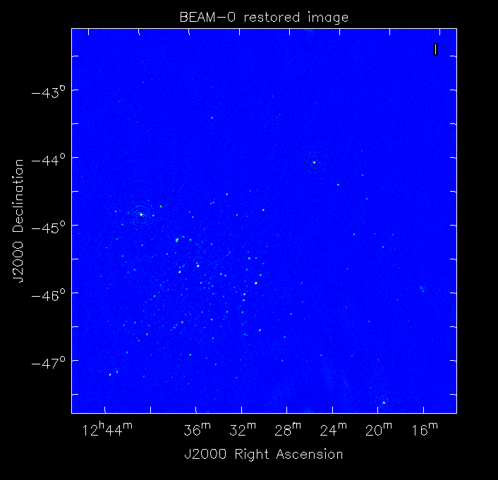
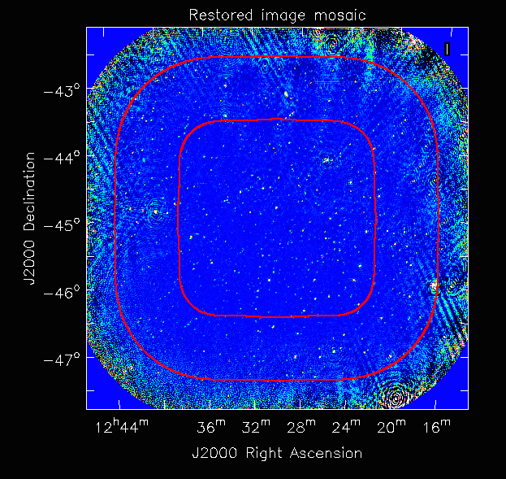

Basic Continuum Imaging Tutorial
=================================

This tutorial demonstrates basic continuum imaging using ASKAPsoft, with a simulated observation that aims to replicate a "typical" observation with BETA. This tutorial will cover the following tasks:

* Download of the measurement sets
* Calibration of individual beams using observations of 1934-638
* Imaging of a simulated science observation of a complex continuum sky, including application of the gains calibration
* Mosaicking individual beam images to form a full-field continuum image

Observation summary
-------------------
The data to be reduced consists of two distinct parts.

The first has 9 short (6 minute) simulated observations of 1934-638, one for each of the 9 beams. Each observation has its own measurement set. These used the BETA array, covering 304 MHz at full spectral resolution (16416 channels), between 746 and 1050 MHz. Thermal noise (Tsys=50K), plus a single set of random gains, have been added to the visibilities. Summary of the specifications:

* Target: 1934-638
* Direction: RA=19:39:25.036, Dec=-63:42:45.63 (J2000)
* Observation length: 6 minutes per beam
* Integration time: 5 seconds
* Number of beams: 9 per observation
* Polarisations: XX & YY
* Number of spectral channels: 16416
* Channel width: 18.518518 kHz
* Tsys: 50K
* Gains corruption: Yes

The second is a long (12 hour) simulated observation of a "science field". The sky model used in the field is our standard "SKADS" field, which uses continuum sources from the SKADS S3-SEX simulation (`Wilman et al (2008), MNRAS 388, 1385`_). Each component has its own spectral index, which should be recoverable from the imaging results. The observation had the same spectral backend as the calibration observations, as well as thermal noise and gains corruption (using the same random gains as the calibration observations). Summary of the specifications:

* Target: SKADS field
* Direction: RA=12:30:00.00, Dec=-45:00:00.0 (J2000)
* Observation length: 12 hours
* Integration time: 5 seconds
* Number of beams: 9 
* Polarisations: XX & YY
* Number of spectral channels: 16416
* Channel width: 18.518518 kHz
* Tsys: 50K
* Gains corruption: Yes

 .. _Wilman et al (2008), MNRAS 388, 1385: http://adsabs.harvard.edu/abs/2008MNRAS.388.1335W

Prerequisites
-------------
You should read the :doc:`../platform/processing` documentation and in particular have
setup your environment per the section entitled "Setting up your account".

You should also have read the :doc:`intro` and be comfortable with submitting jobs
and monitoring their status.

Setting up a working directory
------------------------------

Your working directory will not be within your home directory, instead it will reside on the fast Lustre filesystem::

    cd /scratch/askap/$USER
    mkdir continuumtutorial
    cd continuumtutorial

Retrieving the tutorial dataset
-------------------------------

There are 10 measurement sets associated with this tutorial. There are nine for the calibration observations (one per beam), named calibrator_J1934m638_forSKADS_BEAM0.ms through calibrator_J1934m638_forSKADS_BEAM8.ms (these are 2.6GB each). The science field has one measurement set, at full spectral resolution, named sciencefield_SKADS.ms (291GB).

The measurement sets reside on the "Commissioning Archive" and can be retrieved using the scp command. As the measurement sets may need to be fetched from tape, they should be staged first. This can be done once on the directory::

    ssh cortex.ivec.org /opt/SUNWsamfs/bin/stage -r /pbstore/groupfs/askap/tutorials/basic_continuum

and then the files can be copied via scp::

    scp -r cortex.ivec.org:/pbstore/groupfs/askap/tutorials/basic_continuum/sciencefield_SKADS.ms .
    scp -r cortex.ivec.org:/pbstore/groupfs/askap/tutorials/basic_continuum/calibrator_J1934m638_forSKADS_BEAM?.ms .

You may notice the **scp** may stall. This is likely due to the fact the data has not been fetched (staged) from tape to disk. This is quite normal, and the length of the stall depends upon the load on the system (e.g. other users).

Calibration
-----------

The first step is to use the **ccalibrator** program to solve the gains calibration. This will be done using the calibrator observations, and will be applied to the science observation. 

Here is a basic parameter set for use with ccalibrator. It has the same sort of structure as the imaging one you would have seen in the intro tutorial, with a few calibration-specific parameters. As ususal, refer to the documentation pages on calibration, gridding and so forth for more details.::

	Ccalibrator.dataset                               = calibrator_J1934m638_forSKADS_BEAM0.ms
	Ccalibrator.nAnt                                  = 6
	Ccalibrator.nBeam                                 = 9
	Ccalibrator.solve                                 = gains
	#						  
	Ccalibrator.calibaccess                           = parset
	Ccalibrator.calibaccess.parset                    = caldata-BEAM0.dat
	#						  
	Ccalibrator.sources.names                         = [field1]
	Ccalibrator.sources.field1.direction	          = [19h39m25.036, -63.42.45.63, J2000]
	Ccalibrator.sources.field1.components             = src
	Ccalibrator.sources.src.calibrator                = 1934-638
	#						  
	Ccalibrator.gridder                               = SphFunc
	#						  
	Ccalibrator.ncycles                               = 5

This parset will solve for the gains for the first calibrator observation. We only care about the BEAM 0 from this observation (which is the beam pointing at 1934), but the task actually tries to solve for all beams.

The calibration is done assuming a model of 1934-638 (the *Ccalibrator.sources.src.calibrator=1934-638* entry) - this is a special unresolved component that accounts for 1934's spectral variation. It puts the component at the position indicated, which happens to be the direction of the observation. *Note the particular format of the direction string, especially the declination!*

Save this parset into a file, say **calibrator-BEAM0.in**. To run this, we need to create a qsub file, say, **calibrator-BEAM0.qsub**::

        #!/usr/bin/env bash
	#PBS -l walltime=01:00:00
	#PBS -l mppwidth=1
	#PBS -l mppnppn=1
	#PBS -N ccal0
	#PBS -j oe
	
	cd $PBS_O_WORKDIR

	aprun -n 1 -N 1 ccalibrator -c calibrator-BEAM0.in > calibrator-BEAM0_${PBS_JOBID}.log

Again, this runs as a serial job, and can be submitted in the usual fashion via::

  qsub calibrator-BEAM0.qsub

Gains Parameters
................

The gains parameters, one for each polarisation, antenna and beam, are written to a file caldata-BEAM0.dat. This has entries that look like the following::

	gain.g11.0.0 = [0.27819,0.680617]
	gain.g11.0.1 = [1.10205,0.0753065]
	gain.g11.0.2 = [0.554685,-0.540324]
	gain.g11.0.3 = [0.670682,0.959503]
	gain.g11.0.4 = [1.14376,-0.171543]
	gain.g11.0.5 = [1.14408,-0.0398638]
	gain.g11.0.6 = [-0.737403,0.560088]
	gain.g11.0.7 = [1.02336,-0.255945]
	gain.g11.0.8 = [-0.818433,-0.248333]
	gain.g11.1.0 = [-0.631561,-0.409769]
	gain.g11.1.1 = [1.29398,0.052276]
	gain.g11.1.2 = [0.547655,0.834172]
	gain.g11.1.3 = [0.271391,-0.790379]
	gain.g11.1.4 = [0.380629,0.674252]
	gain.g11.1.5 = [0.629311,0.410911]
	gain.g11.1.6 = [-0.0787903,1.00496]
	gain.g11.1.7 = [0.41577,-0.881319]
	gain.g11.1.8 = [0.569721,-0.565723]

This file is just a parset, with each line being a parameter specification. Its format is described in more detail in :doc:`../calim/calibration_solutions`, but the format is basically **gain.pol.antenna.beam**. The only relevant entries from this calibration job are those for beam 0 - that is, those with the gain parameter name ending in *.0*.
 
Gains for each beam
...................

The above finds the correct gains for beam 0. To solve them for all other beams, we need to do the same for beams 1-8. To do this for beam 1, we copy the parset to **calibrator-BEAM1.in** and change "BEAM0" in the dataset name to "BEAM1". Similarly, copy the qsub file to **calibrator-BEAM1.qsub** and replace "BEAM0" in the filenames with "BEAM1", then submit.

All other parameters (for now) can remain the same. The direction, importantly, is the same as this is the phase centre for the observation, which has been defined such that it is in the centre of the beam of interest for each measurement set.

This is something that could easily be scripted in one of a variety of ways - this is left as an exercise for the reader! By the end, you should have a set of calibration parsets *caldata-BEAM0.dat* through *caldata-BEAM8.dat*. These will be used to calibrate the individual beam images that will be made next. 

Channel averaging
-----------------

The first step in imaging is to average the visibilities to 304 1MHz channels. There is a measurement set provided that has already had this done, but in case you want to do it yourself, here are the instructions. The averaging is done with the **mssplit** command (read :doc:`../calim/mssplit` for further information) - here is a typical parset::

	# Input measurement set
	# Default: <no default>
	vis         = sciencefield_SKADS.ms
	
	# Output measurement set
	# Default: <no default>
	outputvis   = sciencefield_SKADS_coarseChan.ms
	
	# The channel range to split out into its own measurement set
	# Can be either a single integer (e.g. 1) or a range (e.g. 1-300). The range
	# is inclusive of both the start and end, indexing is one-based. 
	# Default: <no default>
	channel     = 1-16416
	
	# Defines the number of channel to average to form the one output channel
	# Default: 1
	width       = 54

Save this parset into a file, say **mssplit.in**. To run this, we need to create a qsub file, say, **mssplit.qsub**::

        #!/usr/bin/env bash
	#PBS -l walltime=01:00:00
	#PBS -l mppwidth=1
	#PBS -l mppnppn=1
	#PBS -N mssplit
	#PBS -j oe
	
	cd $PBS_O_WORKDIR

	aprun -n 1 -N 1 mssplit -c mssplit.in > mssplit_${PBS_JOBID}.log

This runs as a serial job, using only a single processor. Run this in the usual fashion via::

  qsub mssplit.qsub

Make a note of the ID that qsub returns - you may need this to set up dependencies later on (see the imaging section below).
	

Imaging
-------

To do the imaging we select individual beams and image them independently. This is to replicate what is necessary for actual BETA data as the phase/delay tracking is done independently for each antenna, and this, combined with the poor knowledge of the primary beam, means the joint deconvolution (ie. of all beams at once) will not be reliable.

The imaging is done similarly to that in the introductory tutorial, with two additions. One, we will select an individual beam from the measurement set, and two, we will add some cleaning. Here is an example parset::

	Cimager.dataset                                 = sciencefield_SKADS_coarse.ms
	Cimager.Feed                                    = 0
	#
	# Each worker will read a single channel selection
	Cimager.Channels                                = [1, %w]
	#
	Cimager.Images.Names                            = [image.i.clean.sciencefield.BEAM0]
	Cimager.Images.shape                            = [2048,2048]
	Cimager.Images.cellsize                         = [10arcsec,10arcsec]
	Cimager.Images.image.i.clean.sciencefield.BEAM0.frequency          = [898.e6, 898.e6]
	Cimager.Images.image.i.clean.sciencefield.BEAM0.nchan              = 1
	Cimager.Images.image.i.clean.sciencefield.BEAM0.direction          = [12h30m00.00, -45.00.00.00, J2000]
	Cimager.Images.image.i.clean.sciencefield.BEAM0.nterms             = 2
	#
	# The following are needed for MFS clean
	Cimager.nworkergroups                           = 3
	Cimager.visweights                              = MFS
	Cimager.visweights.MFS.reffreq                  = 898.e6
	#
	Cimager.gridder.snapshotimaging                 = true
	Cimager.gridder.snapshotimaging.wtolerance      = 2600
	Cimager.gridder                                 = WProject
	Cimager.gridder.WProject.wmax                   = 2600
	Cimager.gridder.WProject.nwplanes               = 99
	Cimager.gridder.WProject.oversample             = 4
	Cimager.gridder.WProject.diameter               = 12m
	Cimager.gridder.WProject.blockage               = 2m
	Cimager.gridder.WProject.maxfeeds               = 9
	Cimager.gridder.WProject.maxsupport             = 512
	Cimager.gridder.WProject.variablesupport        = true
	Cimager.gridder.WProject.offsetsupport          = true
	Cimager.gridder.WProject.frequencydependent     = true
	#
	Cimager.solver                                  = Clean
	Cimager.solver.Clean.algorithm                  = BasisfunctionMFS
	Cimager.solver.Clean.niter                      = 5000
	Cimager.solver.Clean.gain                       = 0.5
	Cimager.solver.Clean.scales                     = [0, 3, 10]
	Cimager.solver.Clean.verbose                    = False
	Cimager.solver.Clean.tolerance                  = 0.01
	Cimager.solver.Clean.weightcutoff               = zero
	Cimager.solver.Clean.weightcutoff.clean         = false
	Cimager.solver.Clean.psfwidth                   = 512
	Cimager.solver.Clean.logevery                   = 100
	Cimager.threshold.minorcycle                    = [30%, 0.9mJy]
	Cimager.threshold.majorcycle                    = 1mJy
	Cimager.ncycles                                 = 4
	Cimager.Images.writeAtMajorCycle                = false
	#
	Cimager.preconditioner.Names                    = [Wiener, GaussianTaper]
	Cimager.preconditioner.GaussianTaper            = [30arcsec, 30arcsec, 0deg]
	Cimager.preconditioner.Wiener.robustness        = 0.0
	Cimager.preconditioner.Wiener.taper             = 64
	#
	Cimager.restore                                 = true
	Cimager.restore.beam                            = fit
	#
	# Apply calibration
	Cimager.calibrate                               = true
	Cimager.calibaccess                             = parset
	Cimager.calibaccess.parset                      = caldata-BEAM0.dat
	Cimager.calibrate.scalenoise                    = true
	Cimager.calibrate.allowflag                     = true
	
Before running this, let's look at a few key features of this parset. First is this::

	Cimager.Feed                                    = 0

This does the selection-by-beam, where we only use data for *feed=0* in the measurement set. 

The calibration is applied by the following::

	Cimager.calibrate                               = true
	Cimager.calibaccess                             = parset
	Cimager.calibaccess.parset                      = caldata-BEAM0.dat
	Cimager.calibrate.scalenoise                    = true
	Cimager.calibrate.allowflag                     = true

where we choose the calibration parameters parset that was produced by ccalibrator for the beam we are selecting.

We grid the data using the *WProject* gridder. We choose this for this simulation, since it does not include any primary beam correction. We don't know the primary beam for BETA well enough, so we grid with WProject, then apply analytic primary beam weights in the mosiacking stage.

We are doing multi-frequency synthesis for this image. This is controlled by the following parameters::

	Cimager.visweights                              = MFS
	Cimager.visweights.MFS.reffreq                  = 898.e6

This will result in the creation of "Taylor-term images". These represent the Taylor terms that represent the frequency dependence of each spatial pixel. The different terms relate to the spectral index (alpha) and spectral curvature (beta) of the spectrum, which can be defined through a second-order polynomial in log-space, shown in the first equation below. The second equation shows the result of a Taylor expansion about the reference frequency.

The Taylor term images then contain the coefficients of this expansion, so that the image with suffix *.taylor.0* contains I(nu0), *.taylor.1* contains I(nu0)*alpha, and *.taylor.2* contains I(nu0)*(0.5*alpha*(alpha-1)+beta). The reference frequency is given by the *Cimager.visweights.MFS.reffreq* parameter (in Hz) - this should be in the middle of the band for optimal performance.

The cleaning is controlled by these parameters::

	Cimager.solver                                  = Clean
	Cimager.solver.Clean.algorithm                  = BasisfunctionMFS

and those following. The algorithm *BasisfunctionMFS* is a good way of doing the multi-scale multi-frequency synthesis. Read :doc:`../calim/solver` for information on all the clean options. The multi-scale part is controlled by::

	Cimager.solver.Clean.scales                     = [0, 3, 10]

This will clean with components of size 0 pixels (ie. point sources), 3 pixels and 10 pixels.

Finally, note that the above parset has::

	Cimager.Images.writeAtMajorCycle                = false

Setting this to true can be useful if you want to look at the intermediate major cycles of the cleaning, but it does produce a lot more images. To save clutter we'll keep it at *false* for now.

To run the imaging, we need a qsub file - call it **clean-BEAM0.qsub**::

	#!/usr/bin/env bash
	#PBS -l walltime=02:00:00
	#PBS -l mppwidth=913
	#PBS -l mppnppn=20
	#PBS -N clean0
	#PBS -j oe
	
	cd $PBS_O_WORKDIR
	
	aprun -n 913 -N 20 cimager -c clean-BEAM0.in > clean-BEAM0_${PBS_JOBID}.log

Note that the number of processes has increased compared to the intro tutorial. That's because we are doing MFS imaging, and we have requested::

	Cimager.nworkergroups                           = 3

in the parset. This assigns each Taylor term to a separate processor, to spread the work and help speed things up. This way, we now have (3 worker groups * 304 channels + 1 master) processes (i.e. 913).

You can submit this in the usual way, but if you have run the mssplit job, this may still be going, and it needs that to finish first. You can still submit the imaging job, but make it depend on the successful completion of the mssplit job. If the ID of the mssplit job is 1234.rtc, then you can submit the imaging job via::

  qsub -Wdepend=afterok:1234.rtc clean-BEAM0.qsub

Once this completes, you will have a larger set of image products than was produced for the dirty imaging in the intro tutorial:

+---------------------------------------------+------------------------------------------------------------+
| **Filename**                                | **Description**                                            |
+=============================================+============================================================+
| image.i.clean.sciencefield.BEAM0            | The clean model image - pixel map of the clean components. |
+---------------------------------------------+------------------------------------------------------------+
| image.i.clean.sciencefield.BEAM0.restored   | The cleaned, restored image.                               |
+---------------------------------------------+------------------------------------------------------------+
| mask.i.clean.sciencefield.BEAM0             | The normalised mask showing the scaling of sensitivity due |
|                                             | to the primary beam.                                       |
+---------------------------------------------+------------------------------------------------------------+
| psf.i.clean.sciencefield.BEAM0              | The natural PSF image (transform of the UV coverage).      |
+---------------------------------------------+------------------------------------------------------------+
| psf.image.i.clean.sciencefield.BEAM0        | The PSF image after preconditioning (weighting, tapering). |
|                                             | This is the actual PSF of the image                        |
+---------------------------------------------+------------------------------------------------------------+
| residual.i.clean.sciencefield.BEAM0         | Residual image                                             |
+---------------------------------------------+------------------------------------------------------------+
| sensitivity.i.clean.sciencefield.BEAM0      | Sensitivity pattern image                                  |
+---------------------------------------------+------------------------------------------------------------+
| weights.i.clean.sciencefield.BEAM0          | Weights image                                              |
+---------------------------------------------+------------------------------------------------------------+

The restored image should look something like the following (for the BEAM0 case). 

The image size has been chosen so that it is sufficient for the full mosaic image, and has the phase centre of the observation at the middle, but the portion imaged only includes our selected beam. Since we have used the WProject gridder, the weights image will be flat (the AWProject gridder produces weights images showing the primary beam pattern, but we are avoiding this for early BETA imaging). 

However, it also means that the fluxes of sources in these individual beam images will be increasingly incorrect as we move away from the beam centre. For instance, the bright source near RA=12:26, Dec=-44, is actually >3Jy, but we measure its flux in BEAM0 as only about 62mJy. We will correct for this in the mosaicking step below.

Mosaicking
----------

We repeat the imaging for each beam, imaging only a single beam each time, so that we get images for BEAM0 through BEAM8. Once this is done, we need to mosaic the images together to form the final full-field image. This is done with the **linmos** program, information on which can be found at :doc:`../calim/linmos`.

The mosaicking program is driven by a simple parameter set. Consider the following::

	linmos.names         = [BEAM0..8]
	linmos.findmosaics   = true
	linmos.weighttype    = FromPrimaryBeamModel
	linmos.weightstate   = Inherent
	linmos.feeds.centre  = [12h30m00.00, -45.00.00.00]
	linmos.feeds.spacing = 1deg
	linmos.feeds.BEAM0   = [-1.0, -1.0]
	linmos.feeds.BEAM1   = [-1.0,  0.0]
	linmos.feeds.BEAM2   = [-1.0,  1.0]
	linmos.feeds.BEAM3   = [ 0.0, -1.0]
	linmos.feeds.BEAM4   = [ 0.0,  0.0]
	linmos.feeds.BEAM5   = [ 0.0,  1.0]
	linmos.feeds.BEAM6   = [ 1.0, -1.0]
	linmos.feeds.BEAM7   = [ 1.0,  0.0]
	linmos.feeds.BEAM8   = [ 1.0,  1.0]
	linmos.psfref        = 4
	linmos.nterms        = 2

This aims (via the *findmosaics=true* parameter) to do the mosaicking for all sets of images that fit the pattern given in the *names* parameter. The double-fullstop indicates a range of numbers to iterate over. The output name, which isn't given in *findmosaics* mode, is instead determined by replacing the pattern in the *names* parameter with **linmos**. 

All sets of images that fit the pattern will be mosaicked. This will include, in our example, model & restored images for each taylor term, as well as residual, sensitivity and weights images.

The weights are determined here by providing primary beam models, as well as a list of locations of these beams - one for each input image. These primary beam models are simple circularly-symmetric Gaussian functions, with FWHM determined from the frequency of the image being mosaicked. By giving *weightstate = Inherent*, we assume that the input image reflects the primary beam response (which it does when imaged with the WProject gridder), and the mosaicking corrects for this so that the fluxes of sources are correct across the field.

The *psfref* parameter indicates from which number out of that sequence the restoring beam information should be taken. This is necessary as the restoring beam could be different for different images (due to the effect of different calibration). 

The *nterms* parameter tells *linmos* to look for taylor term images, and make multiple output images, one for each taylor term present.

Save this parset into a file, say **linmos_image.in**, and then create a qsub file as before, say, **linmos_image.qsub**::

        #!/usr/bin/env bash
	#PBS -l walltime=01:00:00
	#PBS -l mppwidth=1
	#PBS -l mppnppn=1
	#PBS -N linmos
	#PBS -j oe
	
	cd $PBS_O_WORKDIR

	aprun -n 1 -N 1 linmos -c linmos_image.in > linmos_image_${PBS_JOBID}.log

(again, this is using only a single processor, as **linmos** is a serial application) and run via::

	qsub linmos_image.qsub

This job will produce model, restored, weights, residual and sensitivity images for each of the taylor terms. See :doc:`intro` for details on visualisation of your images. The full mosaicked restored image (image.i.clean.sciencefield.linmos.taylor.0.restored) should look something like the following image. The red lines indicate the weights contours for 50% (inner line) and 1% (outer line) of the peak weight. Note that the outer edges of the field now have increased noise due to the scaling-up of the low-weight points (by the *weighttype=Inherent* correction). 

Exploring the imaging parameters
--------------------------------

Close examination of the resulting image will show various features and artefacts that one might want to address. There are noticeable sidelobes near some of the brighter sources in the top and top-right, for instance, as well as radial features near the bright source to the left. Some examples of alternative tests to try:

* Does it just require deeper cleaning? You can change the number of major cycles using the *Cimager.ncycles* parameter (you may need to increase the time requested in the qsub file.) You can also change the threshold levels for both the minor and major cycles (*Cimager.threshold.minorcycle* and *Cimager.threshold.majorcycle*).
* Is the multi-scale clean capturing all the necessary structure? (This may be important for the bright, extended source at top.) You could try adding a larger-scale term to the *Cimager.solver.Clean.scales* list, although this can result in large-scale noise being added as well, so beware (I have tried it with *[0,3,10,30]*, and found large scale ripples appeared - perhaps these would disappear with better weighting. See the next point).
* The preconditioning of the data will likely have an effect as well. The imaging done above used both Wiener filtering and Gaussian tapering, and both of these can be altered or removed. Some idea of the effect of different values of the parameters can be seen on Emil's `PSF simulations`_ page (which I've moved to my website, but it remains the same...).
* The fidelity of the image can also be improved by tweaking the gridding parameters, although this can be fiddly. Increasing the oversampling, for instance, can improve the image quality at the expense of greater memory usage. If your job fails due to running out of memory, you can decrease the number of processors per node - change the *mppnppn* to 16, say, from 20, as well as the *-N* flag for the aprun call. You will likely have to increase the maxsupport parameter as well - try going up in factors of 2. See :doc:`../calim/gridder` for explanations of the gridding parameters.

  .. _PSF simulations: http://www.atnf.csiro.au/people/Matthew.Whiting/ASKAP/psf/weighted/view.html

